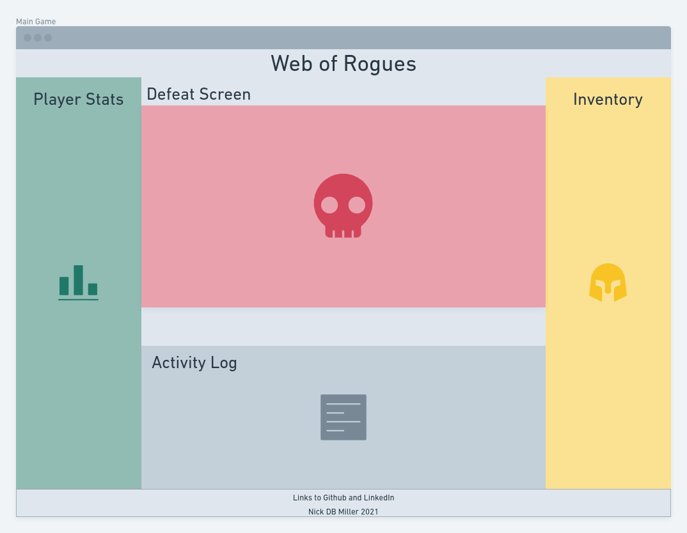

# Project Overview

## Project Name

**_Web of Rogues_** (This will be link to live site on completion)

## Project Description

This project is a browser based *rogue-like* game. The game consists of procedurally generated levels of a "dungeon." The player will have to fight monsters and avoid traps to reach the end and win the game!

## API and Data Sample

This project uses [Roguelike Web API](https://roguelike.docs.apiary.io/) for procedural dungeon generation.

The response data from the API returns an array of ones and zeros, with specifications for the dimensions of "rooms" and "corridors" below:
```
{
    "map": [
        [
            1,
            1,
            1,
            1,
            1,
            1,
            1,
            1,
            1,
            1,
            1,
            1,
            1,
            1,
            1,
            1,
            1,
            1,
            1,
            1,
            1,
            1,
            1,
            1,
            1,
            1,
            1,
            1,
            1,
            1,
            1,
            1,
            1,
            1,
            1,
            1,
            1,
            1,
            1,
            1,
            1,
            1,
            1,
            1,
            1,
            1,
            1,
            1,
            1,
            1,
            1,
            1,
            1,
            1,
            1,
            1,
            1,
            1,
            1,
            1,
            1,
            1,
            1,
            1,
            1,
            1,
            1,
            1,
            1,
            1,
            1,
            1,
            1,
            1,
            1,
            1,
            1,
            1,
            1,
            1
        ], "... This contingues on for about a thousand lines."

    "_width": "25",
    "_height": "80",
    "_rooms": [
        {
            "_x1": 19,
            "_y1": 29,
            "_x2": 21,
            "_y2": 33,
            "_doors": {
                "19,28": 1,
                "20,34": 1
            }
        },
        {
            "_x1": 9,
            "_y1": 9,
            "_x2": 14,
            "_y2": 13,
            "_doors": {
                "15,13": 1
            }
        },
        {
            "_x1": 14,
            "_y1": 20,
            "_x2": 19,
            "_y2": 24,
            "_doors": {
                "14,19": 1,
                "19,25": 1
            }
        },
        {
            "_x1": 16,
            "_y1": 11,
            "_x2": 18,
            "_y2": 15,
            "_doors": {
                "15,13": 1,
                "15,15": 1
            }
        }, "...This also continues on for quite some time."
```
> All this looks like nonsence, but when formatted properly we begin to see how this could be used for making complex dungeons. [See this example of a live site using this API.](http://rogue-api.herokuapp.com)

## Wireframes

#### Main Game


#### Victory Screen


#### Defeat Screen


#### Mobile Layout Vertical


## MVP/PostMVP
#### MVP
- Uses [Roguelike Web API](https://roguelike.docs.apiary.io/) for procedural level generation
- Uses `Flexbox` styling to maintain page layout on different page sizes
- Uses media query to respond to mobile page size
- Displays header with title of game, and footer with links to gitHub and LinkedIn
- Renders in *ASCII Style* graphics
- Player character ("PC") takes turns moving and fighting enemies
- Takes arrow key input from user to move PC up, down, left, and right
- Enemies use simple AI pathing to move toward and "attack" PC
- On finding the "staircase" PC will move to next level
- Displays health stat, points and simple inventory for PC
- Displays activity log for PC actions (eg. "You move West.")
- Displays current level
- When PC reaches staircase on level 10 win condition is met, the activity log announces victory, and dungeon level is replaced with a victory screen
- When PC health reaches zero the game ends and dungeon level is replaced with a defeat screen

#### PostMVP  
*These are examples only. Replace with your own Post-MVP features.*

- Add second API
- Use local storage to save user favorites

## Project Schedule

This schedule will be used to keep track of your progress throughout the week and align with our expectations.  

You are **responsible** for scheduling time with your squad to seek approval for each deliverable by the end of the corresponding day, excluding `Saturday` and `Sunday`.

|  Day | Deliverable | Status
|---|---| ---|
|Dec 10-12| Prompt / Wireframes / Priority Matrix / Timeframes | Incomplete
|Dec 13| Project Approval | Incomplete
|Dec 13| Core Application Structure (HTML, CSS, etc.) | Incomplete
|Dec 14| Pseudocode / actual code | Incomplete
|Dec 15| Initial Clickable Model  | Incomplete
|Dec 16| MVP | Incomplete
|Dec 17| Presentations | Incomplete

## Priority Matrix

Include a full list of features that have been prioritized based on the `Time and Importance` Matrix.  Link this image in a similar manner to your wireframes

## Timeframes

Tell us how long you anticipate spending on each area of development. Be sure to consider how many hours a day you plan to be coding and how many days you have available until presentation day.

Time frames are also key in the development cycle.  You have limited time to code all phases of the game.  Your estimates can then be used to evalute game possibilities based on time needed and the actual time you have before game must be submitted. It's always best to pad the time by a few hours so that you account for the unknown so add and additional hour or two to each component to play it safe. Throughout your project, keep track of your Time Invested and Actual Time and update your README regularly.

| Component | Priority | Estimated Time | Time Invested | Actual Time |
| --- | :---: |  :---: | :---: | :---: |
| Adding Form | H | 3hrs| 3.5hrs | 3.5hrs |
| Working with API | H | 3hrs| 2.5hrs | 2.5hrs |
| Total | H | 6hrs| 5hrs | 5hrs |

## Code Snippet

Use this section to include a brief code snippet of functionality that you are proud of and a brief description.  

```
function reverse(string) {
	// here is the code to reverse a string of text
}
```

## Change Log
 Use this section to document what changes were made and the reasoning behind those changes.  
